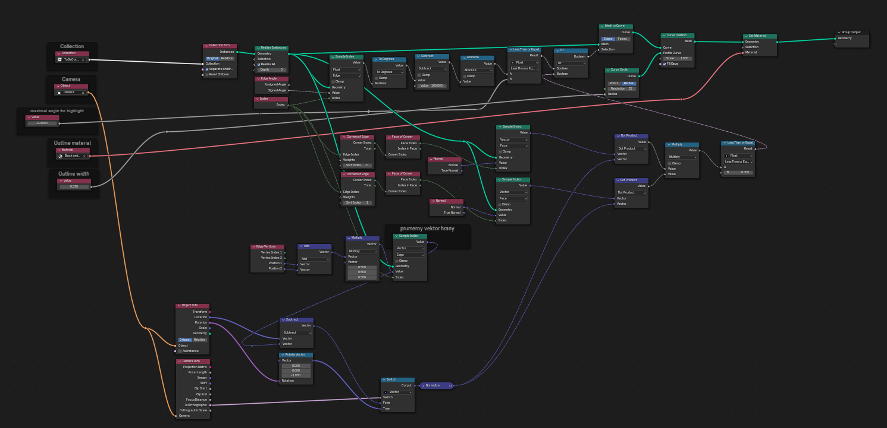
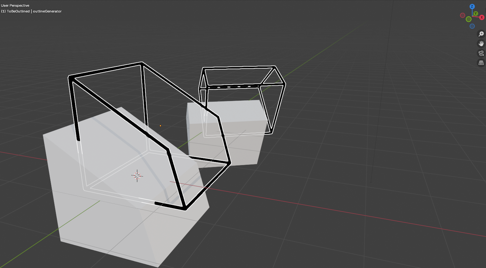

# blenderOutlining
Project with geometry nodes, that detects silhouette and sharp edges and highlights them.

## How to use
Firstly, [download outlines.blend file](outlines.blend), since there is not easy way to share geometry nodes.
When you open the file, you will see something like this:
  
This is an example of things, my project is capable of - highlighting sharp edges and silhouettes.

### outlineGenerator
Please, direct your attention to an object named outlineGenerator.
  
This is an object responsible for generating outlines - it transforms its mesh to match desired outlines.

### Geometry nodes
If you open up geometry nodes of this object (outlineGenerator) you will see all the geometry nodes:
  
Take a look on geometry nodes on the left site of nodes network - you will see pretty customizable input fields:
  

#### Collection
Collection to be outlined, everything outside will be ignored.

#### Camera
Camera used to detect silhouette even based on projection type.

#### Maximal angle for highlight
Angle between faces, bellow which will be edge highlighten.

#### Outline material
Material used to create lines (i recommend one made from emission shader).

#### Outline width
Thickness of outline lines.

### Recommendation
Do not change transform of outlineGenerator object, because it can ruin everything.
 
